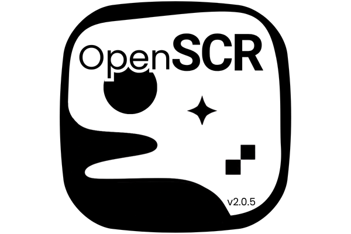

<a id="readme-top"></a>

[![Release][release-shield]][release-url]
[![Contributors][contributors-shield]][contributors-url]
[![Forks][forks-shield]][forks-url]
[![Stars][stars-shield]][stars-url]
[![Issues][issues-shield]][issues-url]
[![MIT License][license-shield]][license-url]
[![Windows][windows-shield]][windows-url]

<br />

<div align="center">
  <a href="https://github.com/bjmvictor/OpenSCR">
    
  </a>

  <h2 align="center">OpenSCR</h2>

  <p align="center">
    <strong>Open-source Windows screen saver creator</strong>
    <br />
    Create screen savers with images, formatted text,
    dynamic variables, and transition effects
    <br /><br />
    <a href="https://github.com/bjmvictor/OpenSCR/releases/latest"><strong>Download latest release</strong></a>
    ·
    <a href="https://github.com/bjmvictor/OpenSCR/issues">Report an issue</a>
    ·
    <a href="https://github.com/bjmvictor/OpenSCR/issues">Request a feature</a>
  </p>
</div>

---

## Features

- Image slideshows with transitions effects.
- Native multi-monitor preview and `.scr` export.
- Formatted text with date, time, computer, and user variables.
- Configurable position, color, margins, and shadow.
- Fade, gradient, zoom, slide, pixel, dissolve, glitch, and blinds transition effects.
- Project files, recent files, light and dark themes, and save protection.
- Brazilian Portuguese, English, Spanish, French, Chinese, and Japanese.

## Download and compatibility

Download the **x64 Setup package** from the
[latest release][release-url].

The same installer supports:

- Windows 10 x64;
- Windows 11 x64;
- Windows Server 2016 build 14393 or newer;

Windows 32-bit is not supported.

## Development

OpenSCR uses **Python 3.10**, **PySide2/Qt 5**, and a native **C++/Win32** screen
saver runtime.

```powershell
git clone https://github.com/bjmvictor/OpenSCR.git
cd OpenSCR
py -3.10 -m venv .venv
.\.venv\Scripts\Activate.ps1
python -m pip install -r requirements.txt
python creator.py
```

Build the native runtime, portable application, and installer with:

```powershell
python build_native_runtime.py
python build_openscr.py
python build_installer.py
```

Rebuilding the native runtime requires CMake, Visual Studio 2022 Build Tools
with Desktop C++, and a Windows SDK. The default `onedir` package is recommended
for distribution; set `OPENSCR_ONEFILE=1` only when a single executable is
required.

## Linux

The Linux build can open, edit, and save OpenSCR projects. Preview and `.scr`
generation remain Windows-only because the native runtime uses Win32 graphics
and the Windows screen-saver protocol.

## Contributing and translations

Contributions and issue reports are welcome. Translation files are plain UTF-8
JSON in [`locales`](locales), making it easy to improve a language or add a new
one. See [`docs/TRANSLATING.md`](docs/TRANSLATING.md) for the contribution
workflow.

<a href="https://github.com/bjmvictor/OpenSCR/graphs/contributors">
  
</a>

## License

OpenSCR 2.0.5 is developed by **Benjamin Victor** and distributed under the
[MIT License](LICENSE).

<p align="right">(<a href="#readme-top">back to top</a>)</p>

---

<!-- MARKDOWN LINKS & IMAGES -->

[release-shield]: https://img.shields.io/github/v/release/bjmvictor/OpenSCR?style=for-the-badge
[release-url]: https://github.com/bjmvictor/OpenSCR/releases/latest
[contributors-shield]: https://img.shields.io/github/contributors/bjmvictor/OpenSCR.svg?style=for-the-badge
[contributors-url]: https://github.com/bjmvictor/OpenSCR/graphs/contributors
[forks-shield]: https://img.shields.io/github/forks/bjmvictor/OpenSCR.svg?style=for-the-badge
[forks-url]: https://github.com/bjmvictor/OpenSCR/network/members
[stars-shield]: https://img.shields.io/github/stars/bjmvictor/OpenSCR.svg?style=for-the-badge
[stars-url]: https://github.com/bjmvictor/OpenSCR/stargazers
[issues-shield]: https://img.shields.io/github/issues/bjmvictor/OpenSCR.svg?style=for-the-badge
[issues-url]: https://github.com/bjmvictor/OpenSCR/issues
[license-shield]: https://img.shields.io/badge/License-MIT-yellow?style=for-the-badge
[license-url]: https://github.com/bjmvictor/OpenSCR/blob/main/LICENSE
[windows-shield]: https://img.shields.io/badge/Windows-x64-0078D4?style=for-the-badge&logo=windows&logoColor=white
[windows-url]: https://github.com/bjmvictor/OpenSCR/releases/latest
